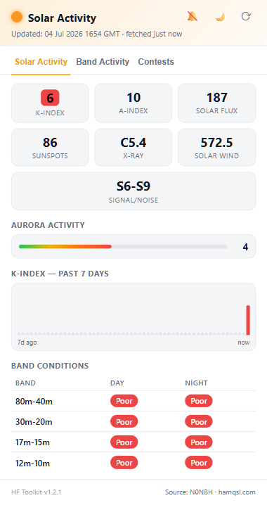
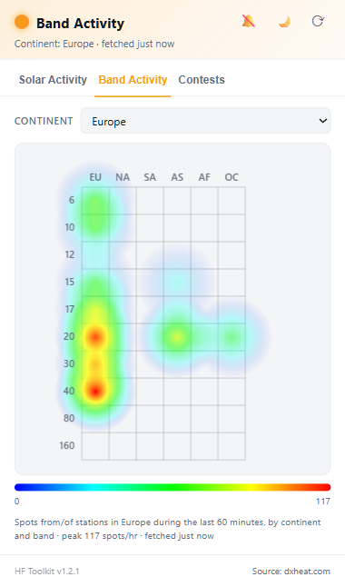
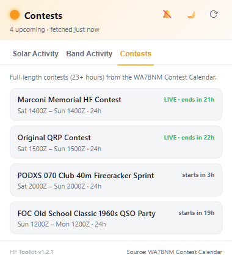
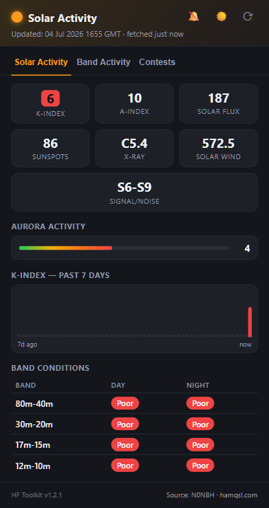
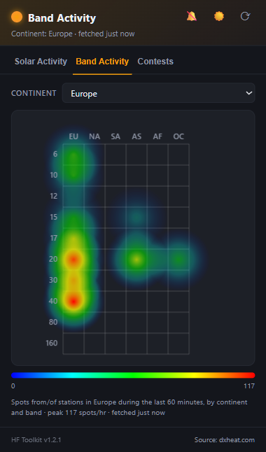
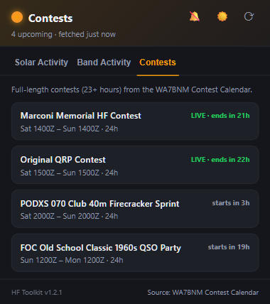

<div align="center">


# HF Toolkit

**A ham radio HF toolkit for your browser toolbar.**

Solar-weather conditions, a live DX spot heatmap, and the contest calendar — in one popup, updated automatically in the background. More tools planned.

</div>

---

## Screenshots

<table>
<tr>
<td align="center" width="33%"><b>Solar Activity</b></td>
<td align="center" width="33%"><b>Band Activity</b></td>
<td align="center" width="33%"><b>Contests</b></td>
</tr>
<tr>
<td></td>
<td></td>
<td></td>
</tr>
<tr>
<td></td>
<td></td>
<td></td>
</tr>
</table>

---

## Features

### ☀️ Solar Activity

The classic space-weather snapshot, parsed live from the [N0NBH solar data feed](https://www.hamqsl.com/solar101.html):

- **K-index, A-index, Solar Flux, Sunspots, X-ray class, Solar Wind, Signal/Noise** — all at a glance in a stat grid
- **Aurora activity meter** — visual 0–9 gauge
- **K-index — Past 7 Days** chart — a 56-bucket (3-hour resolution) history built up over time from repeated fetches; each bucket keeps the **peak** K-index seen in that window, not just the last sample, so brief spikes aren't lost
- **Band Conditions table** — Day/Night propagation rating (Good/Fair/Poor) per HF band
- Data refreshes automatically every 30 minutes via a background alarm, even with the popup closed, plus on-demand whenever you open the popup if the cached data is stale

### 📡 Band Activity

A live heatmap of DX cluster spot density, replicating the style of [dxheat.com](https://dxheat.com/)'s Band Activity widget:

- **Continent × Band grid** — 6 continents (EU/NA/SA/AS/AF/OC) × 10 bands (6m–160m)
- Custom canvas-rendered heat blobs (radial-gradient blending + a jet color scale), matching the classic heatmap.js look
- **Noise filtering**: cells with fewer than 3 spots/hour are hidden so a single stray spot never looks like a hot opening
- **Log-scaled color intensity with a floor**: color reflects an absolute sense of activity, not just "this continent's local peak" — so a quiet continent's lone spot doesn't paint full red the way a genuine 100-spot opening does
- Cached for **30 minutes** per continent to avoid unnecessary refetches, with a manual refresh always available

### 🏆 Contests

Full-length HF contests pulled from the [WA7BNM Contest Calendar](https://www.contestcalendar.com/):

- Filtered to contests running **23+ hours** — the real weekend-length events, not the constant stream of 30–60 minute sprints
- VHF/UHF/SHF/microwave contests are excluded by name so the list stays HF-focused
- **LIVE** badge with a countdown to end, or a "starts in" countdown for upcoming contests
- Click through to each contest's rules page
- Cached for **1 hour**

### 🔔 Alerts (opt-in)

Click the bell icon to turn on background notifications for:

- **K-index ≥ 5** — geomagnetic storm / possible aurora
- **X-ray flux reaching M or X class** — the standard threshold for HF blackouts
- **Any band flipping to "Good"** — a band opening worth checking
- **A followed contest going LIVE**

Alerts are edge-triggered — you're notified once when a condition starts, not repeatedly while it's sustained — and reuse the same 30-minute background alarm as Solar Activity, so there's no extra polling. Off by default; click a notification to jump straight to its source page.

### 🎨 Also included

- Dark / light theme toggle (follows your system preference by default, remembers your override)
- Manual refresh button, context-aware per tab
- Version number shown in the footer, always in sync with the manifest

---

## Data sources

| Source | Used for | Site |
|---|---|---|
| N0NBH | Solar conditions, K-index, band conditions | [hamqsl.com](https://www.hamqsl.com/solar101.html) |
| DXHeat | Band activity heatmap (DX cluster spots) | [dxheat.com](https://dxheat.com/) |
| WA7BNM | Contest calendar | [contestcalendar.com](https://www.contestcalendar.com/) |

## Permissions

| Permission | Why |
|---|---|
| `storage` | Cache fetched data, remember your theme/continent/alert preferences, and build the 7-day K-index history |
| `alarms` | Periodic background refresh (every 30 min) without keeping the popup open |
| `notifications` | Opt-in alerts (bell icon) |
| Host permissions for hamqsl.com, dxheat.com, contestcalendar.com | Fetching each data source directly from the background/popup |

No other sites are contacted, and nothing you type or browse is collected.

---

## Installation (unpacked / developer mode)

1. `npm install`
2. `npm run build`
3. Open `chrome://extensions`, enable **Developer mode** (top right)
4. Click **Load unpacked** and select the `.output/chrome-mv3` folder

## Development

```bash
npm run dev        # hot-reloading dev build
npm run build      # production build → .output/chrome-mv3
npm run compile    # type-check only
npm run zip        # package a distributable .zip
```

Built with [WXT](https://wxt.dev/) (vanilla TypeScript, Manifest V3) and [fast-xml-parser](https://github.com/NaturalIntelligence/fast-xml-parser).

### Project layout

```
entrypoints/
  background.ts       # alarm-driven fetch + alert checks
  popup/               # the three-tab popup UI
lib/
  solar-store.ts       # solar feed fetch, parse, 7-day history storage
  parse-solar-xml.ts   # hamqsl.com XML → SolarSnapshot
  band-activity.ts     # dxheat.com fetch, caching, noise filtering
  heatmap-canvas.ts    # canvas heatmap rendering (grid + color scale)
  contests.ts          # WA7BNM RSS fetch, parsing, caching
  alerts.ts            # threshold notification logic
  constants.ts         # storage keys, thresholds, cache durations
public/icon/           # extension icons (source SVG lives in icon-source.svg)
```
